# RX-M - SSH setup for Cloud Lab Access

RX-M courses can be delivered in conjunction with a cloud based lab environment. To access a cloud lab system, students
will  need to have an ssh client installed on their computer and internet ssh access (port 22).


## macOS/Linux SSH client & key permissions

Any mainstream ssh client will work and macOS/Linux computer systems have a good ssh client preinstalled.

In order to use private key files with ssh on Linux systems, you must change the security attributes so that you alone
have READ-ONLY access. Use the following bash command to achieve this result:

```
$ chmod 400 key.pem
```

The file will retain these permissions after you perform this step once.

Next, start an ssh session with instructions [here](https://github.com/RX-M/classfiles/blob/master/ssh-setup.md#macoslinux--or--windows-command-prompt-or-powershell-ssh).


## Windows SSH client(s) & key permissions

Windows 10 supports ssh natively via Command Prompt and PowerShell but also supports 3rd party ssh client tools (you do
_not_ need to install any or all of them; use what works best for you).

Links to 3rd party installers:

- GitBash ssh command line client (free, part of Git distribution) [Windows/OSX/Linux] https://git-scm.com/downloads
- MobaXTerm (free and paid) [Windows] https://mobaxterm.mobatek.net/download.html
- PuTTY (free) [Windows] https://www.putty.org/

Next, configure SSH key permissions based on your platform of choice:

- [Command Prompt or Powershell](https://github.com/RX-M/classfiles/blob/master/ssh-setup.md#windows-ssh-key-permissions-command-prompt-and-powershell)
- [MobaXTerm](https://github.com/RX-M/classfiles/blob/master/ssh-setup.md#windows-ssh-key-permissions-mobaxterm)
- [PuTTY](https://github.com/RX-M/classfiles/blob/master/ssh-setup.md#windows-ssh-key-permissions-putty)


### Windows SSH key permissions: Command Prompt and PowerShell

In order to use private key files with ssh with Windows _Command Prompt_ or _PowerShell_, you must change the security
attributes so that you alone have READ-ONLY access. Use the following procedure to achieve this result:

- Locate the pem file in Windows Explorer, right-click on it then select "Properties".

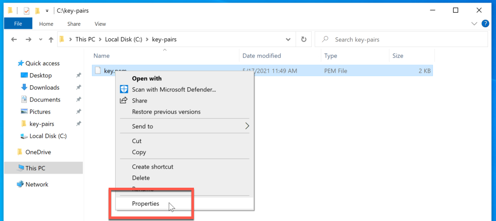

- In the "Properties" window, (1) Navigate to the "Security" tab and (2) click "Advanced".

- In the "Advanced Security Settings" window:
  - (3) _Only if the "Owner" is not your account_, change the owner to you by clicking the "Change" link.
  - (4) Click on the [ Disable Inheritance ] button in the lower left corner.

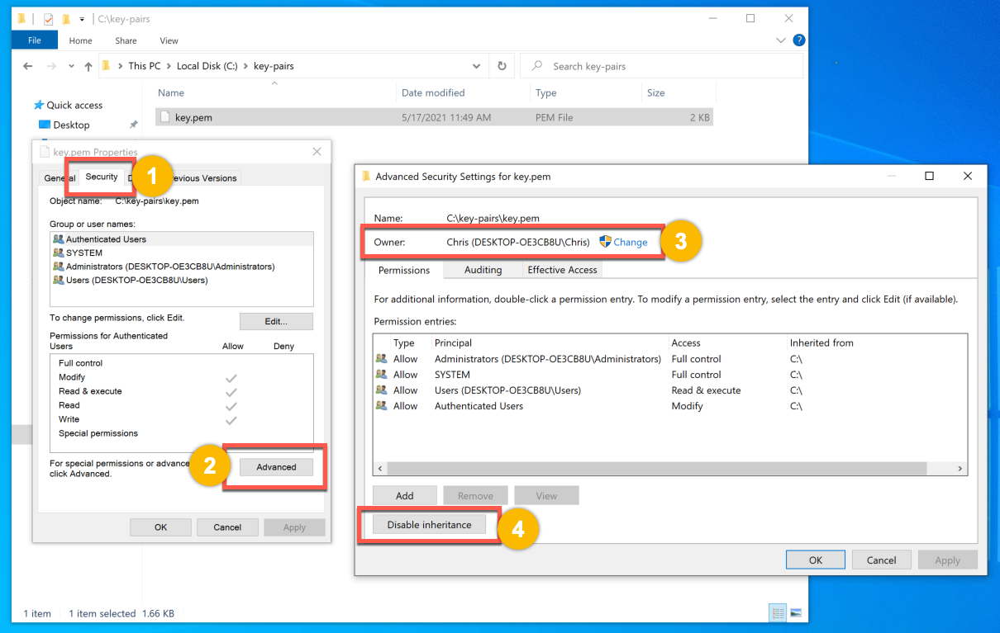

- In the "Block Inheritance" pop-up, select, "Remove all inherited permissions from this object"

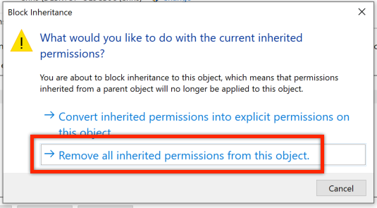  

  - (1) In the "Permission entries" pane, select an existing permission and (2) click the [ Remove ] button.
  - Repeat steps 1 & 2 for each permission, deleting all existing permissions.

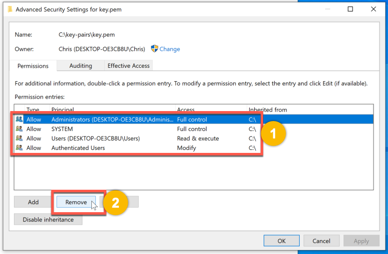

  - After all existing permissions are removed, select the [ Add ] button.

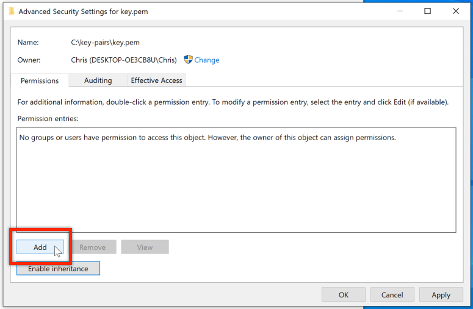

- In the "Permission Entry" window:
  - Select the "Select a Principal" link.

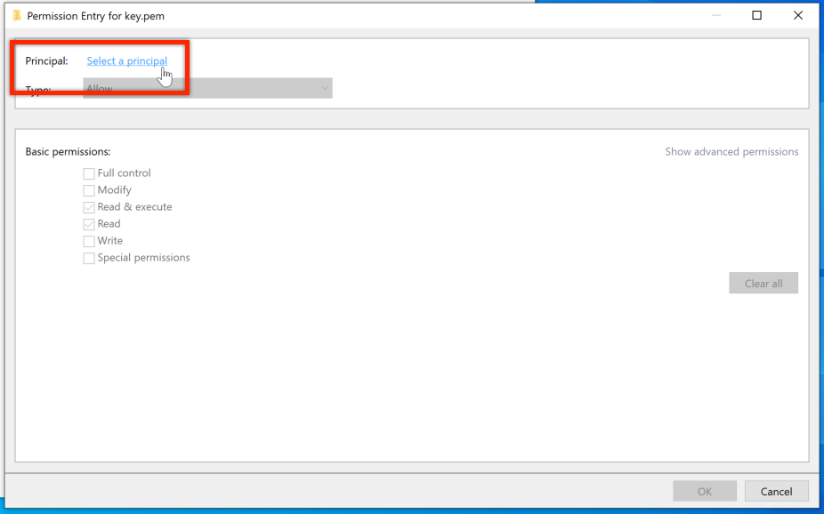

- In the "Select User or Group" window:
  - (1) In the "Enter the object name to select (examples)" text box, type _your username_.
  - (2) Click the [ Check Names ] button to autofill and/or check the username.

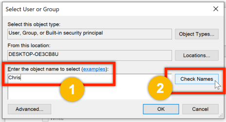

  - After checking the name, the proper syntax should be applied
  - Click the [ OK ] button.

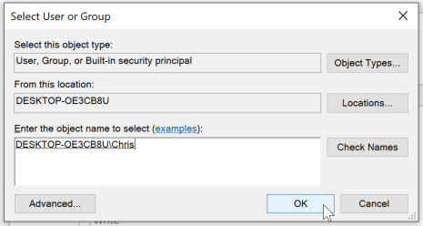

- Back in the "Permission Entry" window:
  - (1) Under "Principal", make sure your user is present.
  - (2) Under "Basic Permissions", add a check (√) to the "Full control" option.
  - (3) Click the [ OK ] button.

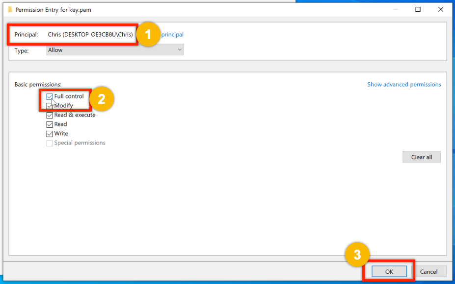

- Back in the "Advanced Security Settings" window, your user should be the only permission in the "Permission entries" field.
  - Click the [ OK ] button.

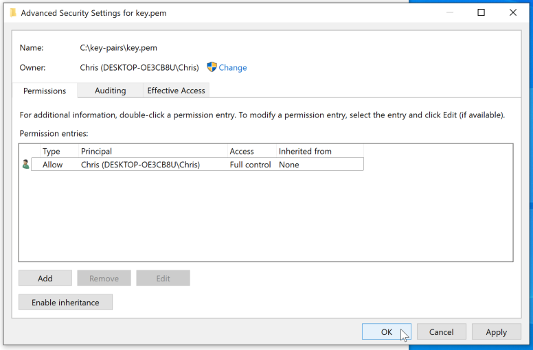

- Finally, back in the "Properties" window, under "Group or user names:", only your user should appear.
  - Click the [ OK ] button.

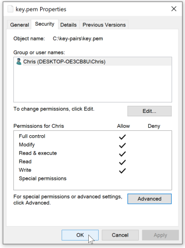

Now SSH will not complain about file permissions being too open and you can ssh from Windows natively. The file will
retain these permissions after you perform this step once.

Next, start an ssh session with instructions [here](https://github.com/RX-M/classfiles/blob/master/ssh-setup.md#macoslinux--or--windows-command-prompt-or-powershell-ssh).


### Windows SSH key permissions: MobaXTerm

MobaXTerm understands the PEM format; no configuration necessary.

Next, start an ssh session with [MobaXTerm](https://github.com/RX-M/classfiles/blob/master/ssh-setup.md#windows-mobaxterm-ssh).


### Windows SSH key permissions: PuTTY

PuTTY does not natively support the PEM format that cloud environments use, so you need to convert your PEM file to a
PPK file (PPK = PuTTY Private Key) before gaining access. To do this, you use the PuTTYgen utility.

To start PuTTYgen the utility you can type `puttygen` in the Windows start dialog box.

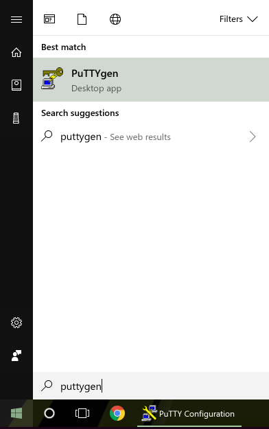

In the PuTTYgen dialog box, click the [ Load ] button:

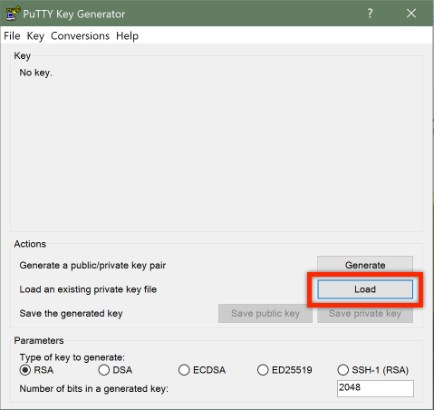

When browsing for your pem file be sure to select _All Files_ in the dropdown list that is located to the right of the
File name field:

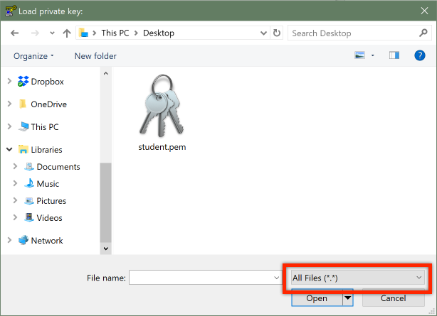

Select the .pem file that you received (called "student.pem" in the screenshot above) and click [ Open ].

Read the PuTTYgen Notice and then click [ Ok ].

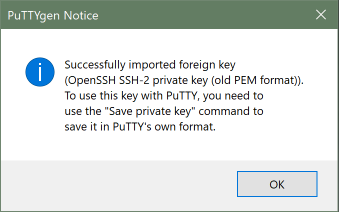

As the notice states, click on [ Save private key ]:

> N.B. if you are asked if you want to save they key without a passphrase you can safely click "Yes".

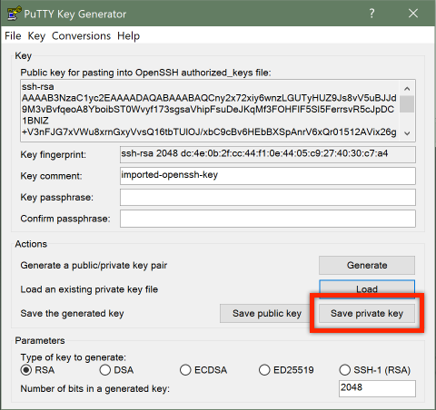

Name the private key file and save it to a path that is easy to remember (we will use the path to the file in putty).


Next, start an ssh session with [PuTTY](https://github.com/RX-M/classfiles/blob/master/ssh-setup.md#windows-putty-ssh).

## SSH


### macOS/Linux -OR- Windows Command Prompt or PowerShell SSH

Command line clients like a Linux shell terminal, macOS Terminal app, Windows Command Prompt or PowerShell can generally
access the cloud lab site by opening the related app/shell and typing a command like this:

```
$ ssh -i key.pem ubuntu@host.ip.ad.dr
```

Where:

- The `-i` switch (for identity) is typically required and allows you to pass a key file to the ssh client ("`key.pem`"
  in the example) for extra security.
- "`ubuntu`" is the default username (the instructor may supply students with a different username in class)
- "`host.ip.ad.dr`" is the host IP address of the student lab system supplied by the instructor during class (e.g.
  54.23.87.45).


### Windows MobaXTerm SSH

Start MobaXTerm and add a new session by clicking on the "Session" icon in the top-left corner or by selecting the
"Sessions" menu and clicking on "New session".

In the "Session settings" window, click on SSH and enter the following information:

1. In the "Remote host" text box, enter the IP address assigned to you (sent via email or assigned in class)
  - Check the box next to "Specify username" and enter `ubuntu`
2. Click on the "Advanced SSH settings" tab
3. Check the box next to "Use private key" and type the path to your .pem file or click on the browse icon which will
let you navigate to the location where you saved it using Windows explorer.

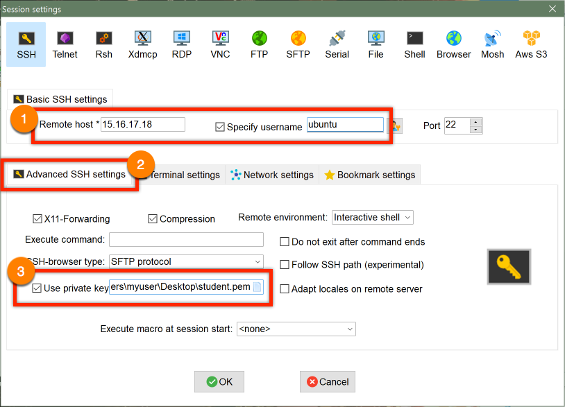

Click on the [ OK ] button to start your SSH session.


### Windows PuTTY SSH

Once you have converted the pem file to a ppk file, you are ready to use PuTTY. Open putty and type connection
information in the "Host Name" text field:

- The user name for ubuntu VMs running in the cloud is "ubuntu"
- The IP address assigned to you (sent via email or assigned in class)

The format should look similar to: `ubuntu@15.16.17.18` (substituting your assigned IP for the example)

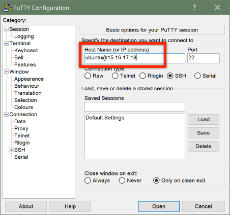

Next, in the "Category" column on the left, click on the "`+`" icon next to the SSH field to expand the section.

In the newly expanded section, click on "Auth".

In the "Private key file for authentication" text field, either type the path to your ppk file or click on the
[ Browse... ] button to open the "Select private key file" dialog which will let you navigate to the location where you
saved it using Windows explorer.


After setting the path to the private key file, you can _optionally_ return to the "Session" category, and under the
"Saved Sessions" text box you can name your session and save it by clicking the [ Save ] button.

Click the [ Open ] button to start your SSH session.


## OPTIONAL X11 Server

_DO NOT follow these instructions unless explicitly instructed to do so._

To support browser GUI sessions over ssh the "X Window System" (X11 or simply X), a windowing system for bitmap
displays, is required.

#### X11 server on macOS

X11 is no longer included with Mac systems (see [this support article](https://support.apple.com/en-us/HT201341)), but
X11 server and  client libraries are available from the [XQuartz project](https://www.xquartz.org/), which Apple created
and contribues to.

1. Open a browser and navigate to https://www.xquartz.org/
2. Download the .dmg file and install
3. Any time an SSH session is launched with the `-X` argument in the normal macOS terminal, the xQuartz program will automatically launch to support the X window.


#### X11 server on Windows

Windows does not include built in X support. Solutions are per client.

- Mobaxterm: X11 is supported natively by mobaxterm and does not require any further installation.
- putty: Requires an external xserver and enabling via: Connection->SSH->X11->Enable X11 Forwarding
- git bash ssh: Requires an external xserver.

Windows X servers:

- VcXsrv: Free Windows X-server based on xorg git sources (like xming or cygwin's xwin, build with Visual Studio) https://sourceforge.net/projects/vcxsrv/files/
- XMing: Freemium Windows X-server based on xorg git sources: https://sourceforge.net/projects/xming/files/Xming/


#### macOS/Linux -OR- Windows Command Prompt or PowerShell with X11 Server

Command line clients can generally access the cloud lab using X11 server with a command like this:

```
$ ssh -i key.pem -X ubuntu@host.ip.ad.dr
```

Where "ubuntu" is the default user name (the instructor may supply students with a different user name  in class) and
"host.ip.ad.dr" is the host IP address of the student lab system supplied by the instructor during class (e.g.
54.23.87.45).

- The `-i` switch (for identity) is typically required in classes. This allows you to pass a key file to the ssh client
  ("key.pem" in the example) for extra security.
- The `-X` switch enables the X11 Window System for using remote GUI applications.


#### X11 server on remote VMs

If using GUI applications on the remote server, on the remote machine export the `DISPLAY` variable:

```
ubuntu@remote-host:~$ export DISPLAY=localhost:10
```

Install, and launch firefox

```
ubuntu@remote-host:~$ sudo apt-get install firefox -y

...

ubuntu@remote-host:~$ firefox &
```

A window on your local system should open with an instance of the Firefox browser from the remote system.
