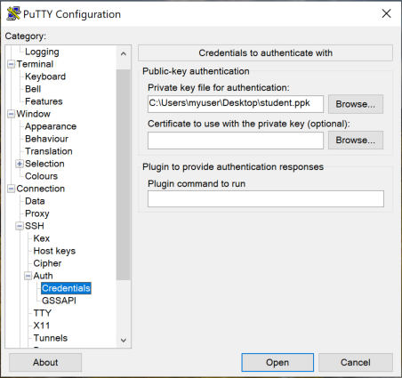

# RX-M - SSH setup for Cloud Lab Access

RX-M courses are delivered in conjunction with a cloud hosted lab system. To access the cloud lab system, students
use an ssh client.

In most cases this is three simple steps:

1. Download the ssh key provided by your instructor to your laptop
2. Change the ssh key file permissions to owner/read-only on your laptop:
     - `$ chmod 400 key.pem`
3. Ssh to your assigned lab system from your laptop (ip provided by instructor):
     - `$ ssh -i key.pem ubuntu@my.lab.ip.addr`

> The lab systems are Ubuntu Linux and the user "ubuntu" is used to login. The systems are protected with keys
> rather than passwords and the "-i" switch is used to pass the private keyfile to ssh. You must replace the
> "my.lab.ip.addr" text above with your assigned IP address. If you fail to restrict the permissions on the key
> file the ssh client may produce and error message (e.g. "Error public key").

Detailed instructions for different systems below.


## Mac/Linux/Git-Bash

Mac/Linux systems have a good ssh client preinstalled that works perfectly for lab system access, as does Git Bash, which
can be installed on Mac/Linux/Windows. Using one of these you can simply open a terminal, make the key file private and
run the appropriate ssh command as outlined above.


## Windows

Windows 10/11 systems typically provide a native ssh client accessible at the Command or PowerShell prompt.
Third party ssh client tools are also frequently used on Windows (choose what works best for you).

> N.B. RX-M reccomends GitBash and MobaXTerm

Links to 3rd party installers:

- GitBash ssh command line client (free, part of Git distribution) [Windows/OSX/Linux] https://git-scm.com/downloads
- MobaXTerm (free and paid) [Windows] https://mobaxterm.mobatek.net/download.html
- PuTTY (free) [Windows] https://www.putty.org/

If you are using any of the third party tools you do not need to adjust the permissions on your key file, you
can simply ssh from the tool into your assigned lab system. Detailed instructions can be found below.

If you will be using the built in Windows ssh client, you will need to configure SSH key permissions as described
in the next section:


### Windows native SSH

In order to use private key files with Windows native ssh you must change the security
attributes so that you alone have READ-ONLY access. Instructions follow:

- Locate the pem file in Windows Explorer, right-click on it then select "Properties".


- In the "Properties" window, (1) Navigate to the "Security" tab and (2) click "Advanced".

- In the "Advanced Security Settings" window:
  - (3) _Only if the "Owner" is not your account_, change the owner to you by clicking the "Change" link.
  - (4) Click on the [ Disable Inheritance ] button in the lower left corner.


- In the "Block Inheritance" pop-up, select, "Remove all inherited permissions from this object"

  

  - (1) In the "Permission entries" pane, select an existing permission and (2) click the [ Remove ] button.
  - Repeat steps 1 & 2 for each permission, deleting all existing permissions.


  - After all existing permissions are removed, select the [ Add ] button.


- In the "Permission Entry" window:
  - Select the "Select a Principal" link.


- In the "Select User or Group" window:
  - (1) In the "Enter the object name to select (examples)" text box, type _your username_.
  - (2) Click the [ Check Names ] button to autofill and/or check the username.


  - After checking the name, the proper syntax should be applied
  - Click the [ OK ] button.


- Back in the "Permission Entry" window:
  - (1) Under "Principal", make sure your user is present.
  - (2) Under "Basic Permissions", add a check (√) to the "Full control" option.
  - (3) Click the [ OK ] button.


- Back in the "Advanced Security Settings" window, your user should be the only permission in the "Permission entries" field.
  - Click the [ OK ] button.


- Finally, back in the "Properties" window, under "Group or user names:", only your user should appear.
  - Click the [ OK ] button.


Now SSH will not complain about file permissions being too open and you can ssh from Windows natively. The file will
retain these permissions after you perform this step once.

Next, start an ssh session with a [shell](https://github.com/RX-M/classfiles/blob/master/ssh-setup.md#macoslinux--or--windows-gitbash-command-prompt-or-powershell-ssh).


### Windows MobaXTerm

To use MobaXTerm for ssh, start MobaXTerm and add a new session by clicking on the "Session" icon in the top-left corner
or by selecting the "Sessions" menu and clicking "New session".

In the "Session settings" window, click on SSH and enter the following information:

1. In the "Remote host" text box, enter the IP address assigned to you (sent via email or assigned in class)
  - Check the box next to "Specify username" and enter `ubuntu`
2. Click on the "Advanced SSH settings" tab
3. Check the box next to "Use private key" and type the path to your .pem file or click on the browse icon which will
let you navigate to the location where you saved it using Windows explorer.


Click on the [ OK ] button to start your SSH session.


### Windows PuTTY

PuTTY does not support the PEM format used by cloud environments. You can convert PEM files to Putty's
PPK format (PPK = PuTTY Private Key) using the PuTTYgen utility.

To start the PuTTYgen utility you can type `puttygen` in the Windows start dialog box.


In the PuTTYgen dialog box, click the [ Load ] button:


When browsing for your pem file be sure to select _All Files_ in the dropdown list that is located to the right of the
File name field:


Select the .pem file that you received (called "student.pem" in the screenshot above) and click [ Open ].

Read the PuTTYgen Notice and then click [ Ok ].


As the notice states, click on [ Save private key ]:

> N.B. if you are asked if you want to save they key without a passphrase you can safely click "Yes".


Name the private key file and save it to a path that is easy to remember (we will use the path to the file in putty).

Next, start an ssh session with [PuTTY](https://github.com/RX-M/classfiles/blob/master/ssh-setup.md#windows-putty-ssh).

Once you have converted the pem file to a ppk file, you are ready to use PuTTY. Open putty and type connection
information in the "Host Name" text field:

- The user name for ubuntu VMs running in the cloud is "ubuntu"
- The IP address assigned to you (sent via email or assigned in class)

The format should look similar to: `ubuntu@15.16.17.18` (substituting your assigned IP for the example)


Next, in the "Category" column on the left, click on the "`+`" icon next to the SSH field to expand the section.

In the newly expanded section, click on "Auth".

In the "Private key file for authentication" text field, either type the path to your ppk file or click on the
[ Browse... ] button to open the "Select private key file" dialog which will let you navigate to the location where you
saved it using Windows explorer.



After setting the path to the private key file, you can _optionally_ return to the "Session" category, and under the
"Saved Sessions" text box you can name your session and save it by clicking the [ Save ] button.

Click the [ Open ] button to start your SSH session.


## SSH Port Forwarding

Some environments (ZScaler, etc.) may block browser (HTTP) access from your laptop to the cloud lab system. You can
easily and securily bypass this restriction with port forwarding through an ssh tunnel.

For example, imagine you are running a lab which requires you to access a web GUI on port 8080 on your cloud based
lab system. If your local or corporate environment blocks this access you can open a tunnel on your laptop to the lab
system web GUI as follows:


```
$ ssh -i key.pem -L 127.0.0.1:1234:127.0.0.1:8080 ubuntu@my.lab.ip.addr
```

Taking this command apart:

- `ssh` - invokes the ssh command, which in this case will create an ssh session while also opening the requested tunnel
- `-i key.pem` - this provides the private key needed to create the ssh tunnel
- `-L 127.0.0.1:1234:127.0.0.1:8080` - this is the Local port forwarding command:
    - `127.0.0.1:1234` - this causes the ssh command to forward localhost laptop connections targeting port "1234"
    - `127.0.0.1:8080` - this completes the connection to the remote cloud system localhost port "8080"
- `ubuntu@my.lab.ip.addr` - this logs you in as "ubuntu" on the system with ip address "my.lab.ip.addr"

After issueing this command you can open a browser on your **laptop** using the url `http://127.0.0.1:1234/`
to reach the web GUI running on your **lab system** at `127.0.0.1:8080`.

If you need to browse to multiple ports on your lab system you can use multiple `-L` switches. You must select a unique
local port that is not in use on your laptop with each `-L` port forwarding ("1234" was used in the example above, so
you could forward "1235" to a second port on the lab system, for example).
